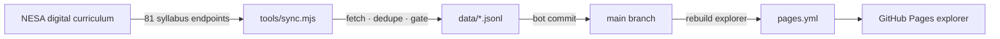

# NSW Curriculum Learning Outcomes

[](https://github.com/MaksimZinovev/curriculum-learning-outcomes-au/actions/workflows/sync.yml)
[](https://github.com/MaksimZinovev/curriculum-learning-outcomes-au/actions/workflows/pages.yml)
[](LICENSE)

<p align="center">
  
</p>

The NSW (NESA) curriculum as structured, machine-readable data. `tools/sync.mjs`
fetches every syllabus outcomes page on curriculum.nsw.edu.au, normalizes the
content, and commits `data/outcomes.jsonl` + `data/syllabuses.json` on change.
GitHub Actions runs it monthly. A zero-dependency single-file explorer makes
the catalog searchable at
[https://maksimzinovev.github.io/curriculum-learning-outcomes-au/](https://maksimzinovev.github.io/curriculum-learning-outcomes-au/).

## Who is this for

Developers building education tools on the NSW curriculum. Today that is
[Scoolendar](https://github.com/MaksimZinovev/groundcrew-scoolendar-private),
which needs outcomes as selectable, searchable records — codes like
`MA4-ALG-C-01` with descriptions, stages, and syllabus context — instead of
scraping NESA pages or matching free-text codes. Anyone can use the published
JSONL directly, or fork the pipeline for another NESA-shaped source.

## What it does

### Monthly sync

On the 2nd of each month (03:17 UTC), Actions runs the sync. It discovers all
syllabuses on curriculum.nsw.edu.au, resolves the site's Next.js `buildId`,
fetches the structured JSON endpoint behind every outcomes page, normalizes
it, and commits the refreshed data. Each run leaves the exact raw payloads in
a 90-day workflow artifact — a complete audit trail, without bloating git.

### Clean, deduplicated records

NESA's CMS mirrors some outcomes across syllabus sections. The sync emits each
record once — mainstream rows and their linked Life Skills variants — keyed by
CMS codename ([ADR 0001](shaping/adr/0001-dedupe-outcomes-by-codename.md)).

### Guardrails

The sync refuses to corrupt history. A >10% drop in total outcomes aborts the
run with no writes. A failed syllabus fetch never deletes last-known data:
stale rows are kept and flagged. Print-layout dummies are skipped silently.

### Outcomes explorer

`tools/build-playground.mjs` compiles the data into a single gitignored HTML
file: filter by KLA / stage / syllabus, full-text search, presets, and a
ChatGPT handoff prompt. Deployed to GitHub Pages automatically.

## Data

| File | Contents |
| ---- | -------- |
| `data/outcomes.jsonl` | 1682 outcome records — one JSON object per line |
| `data/syllabuses.json` | 81 syllabuses with learning area and stage coverage |
| `data/sync-metadata.json` | Last run stats: counts, dedupe, gate result, buildId |

1068 mainstream outcomes + 614 Life Skills outcomes across 81 syllabuses.

| Field | Meaning |
| ----- | ------- |
| `code` | Human code, e.g. `MA4-ALG-C-01` |
| `title` | Outcome title (often empty) |
| `descriptionText` / `descriptionHtml` | Outcome statement |
| `lifeSkills` | Life Skills variant of the outcome |
| `isOverarching` | Syllabus-level outcome |
| `stages` | `ES1`…`S6`, canonical order |
| `relatedLifeSkillsOutcomeCodes` | Mainstream ↔ Life Skills links |
| `syllabus` / `syllabusYear` / `syllabusSlug` / `syllabusCodename` | Parent syllabus |
| `kla` | Key learning area |
| `sourceUrl` | Page on curriculum.nsw.edu.au |
| `codename` | CMS identity — dedupe key |
| `fetchedAt` | Sync timestamp |

```json
{"codename":"al_k_10_ms_oc_al1_com_01","code":"AL1-COM-01","title":"","descriptionHtml":"<p>composes texts in the target language using modelled language</p>","lifeSkills":false,"isOverarching":false,"stages":["Stage 1"],"relatedLifeSkillsOutcomeCodes":[],"descriptionText":"composes texts in the target language using modelled language","syllabusCodename":"aboriginal_languages_k_10_2022","syllabusSlug":"aboriginal-languages-k-10-2022","syllabus":"Aboriginal Languages K–10","syllabusYear":2022,"kla":"Languages","sourceUrl":"https://curriculum.nsw.edu.au/learning-areas/languages/aboriginal-languages-k-10-2022/outcomes","fetchedAt":"2026-09-05T12:15:13.514Z"}
```

## Why this approach

- **Data in git, not in a database.** JSONL diffs well, the commit history is
  a change log, and any consumer can read it without infrastructure.
- **Zero dependencies.** Node 22 built-in `fetch`, one script. Nothing to
  audit, nothing to patch.
- **Deterministic before clever.** Fetch, dedupe, normalize, validate — plain
  code. The pipeline is inspectable end to end in one file.
- **Fail safe on upstream changes.** NESA's site will change eventually. The
  gate and stale-row handling mean the dataset degrades loudly, not silently.
- **The explorer is a build artifact.** 650KB single HTML file, generated
  from `data/`, never hand-edited, never committed.

## Architecture

- **`tools/sync.mjs`** — fetcher and normalizer. Discovers syllabuses,
  resolves the Next.js `buildId`, fetches the `_next/data` JSON endpoints,
  dedupes, applies the gate, writes `data/`.
- **GitHub Actions** — two workflows. `sync.yml`: monthly cron, uploads raw
  payloads as artifacts, bot-commits refreshed data. `pages.yml`: rebuilds
  and deploys the explorer on every data change.
- **`tools/build-playground.mjs`** — compiles the single-file explorer from
  `tools/playground-template.html` + `data/`.
- One script, two workflows, no server.



## Project structure

```
.
├── assets/                   # README media
├── data/                     # committed sync outputs (the dataset)
│   ├── outcomes.jsonl        # 1682 outcome records
│   ├── syllabuses.json       # 81 syllabuses
│   ├── sync-metadata.json    # last run stats
│   └── raw/                  # gitignored raw API payloads
├── docs/
│   ├── nesa/                 # source PDFs downloaded from NESA
│   └── sample_report.pdf     # tutoring report sample (consumer context)
├── shaping/                  # design docs: spec, recon, probe, ADRs
├── tools/
│   ├── sync.mjs              # fetcher / normalizer / gate
│   ├── build-playground.mjs  # compiles the explorer
│   └── playground-template.html
└── .github/workflows/        # sync.yml (monthly), pages.yml (Pages)
```

## Reuse

The dataset is the point: read `data/outcomes.jsonl` in any language. To
repoint the pipeline at a different source, swap the discovery and endpoint
logic in `tools/sync.mjs` — normalization, dedupe, and gate are
source-shaped but small. No secrets and no configuration are needed; the
two test hooks below exist for CI-style verification.

## Status

**Shipped** — the full pipeline and explorer are live.

**Done**

- Monthly sync: 1682 outcomes / 81 syllabuses, ~4s fetch, zero warnings
- Dedupe of mirrored Life Skills records — [ADR 0001](shaping/adr/0001-dedupe-outcomes-by-codename.md)
- Gate tested: forced drop aborts with no writes; forced fetch failure keeps stale rows flagged
- Single-file explorer live on GitHub Pages

**Planned**

- Scoolendar ingest and search against `outcomes.jsonl`
- Matching legacy free-text outcome codes (`PD3-4` style) — documented gap, see `shaping/`
- Nightly soft re-sync for faster stale-row recovery

## Config

```bash
node tools/sync.mjs          # run the sync locally (Node 22+, zero deps)
node tools/build-playground.mjs  # rebuild the explorer from data/
```

Run the sync manually from the Actions tab (`sync` → Run workflow). Test
hooks for verifying the guardrails without touching real data:

| Variable | Effect |
| -------- | ------ |
| `SYNC_PREV_TOTAL` | Pretend a previous total — `99999` forces the gate to abort |
| `SYNC_FAIL_SLUGS` | Comma-separated syllabus slugs to simulate failed fetches |

## License

Code: [MIT](LICENSE). Curriculum data © NSW Education Standards Authority
(NESA); reproduced from public pages for reference — check NESA's terms
before redistributing it in a product.
