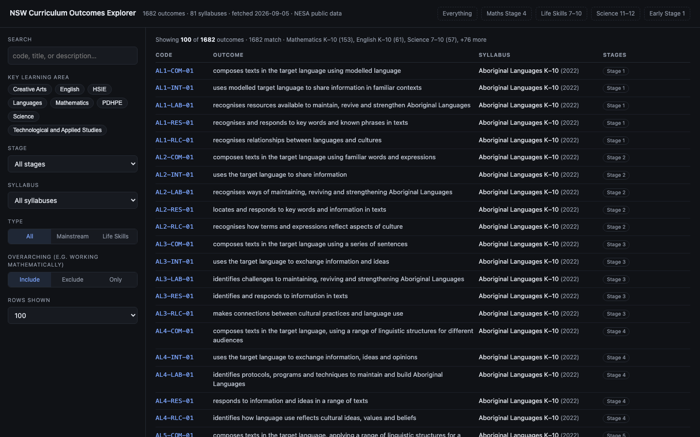
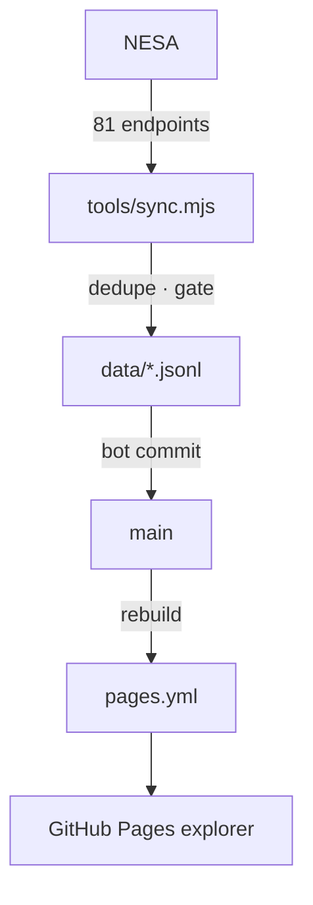

# NSW Curriculum Learning Outcomes

[](https://github.com/MaksimZinovev/curriculum-learning-outcomes-au/actions/workflows/sync.yml)
[](LICENSE)
<br>
[](data/outcomes.jsonl)

<p align="center">
  
</p>

The NSW (NESA) curriculum as structured data. `tools/sync.mjs` fetches all 81
syllabus outcomes pages on curriculum.nsw.edu.au and commits `data/*.jsonl` weekly via Actions. A single-file explorer serves it at
[github.io](https://maksimzinovev.github.io/curriculum-learning-outcomes-au/).

## Who is this for

- Developers building education tools on the NSW curriculum. Today that is
  [Scoolendar](https://scoolendar.com/),
  which needs outcomes as selectable records instead of scraping NESA pages or
  matching free-text codes.
- Regular users who want to explore the NSW curriculum outcomes without
  diving into the raw data.

## What it does

### Weekly sync

Actions runs the sync every Sunday and bot-commits refreshed
data. Raw payloads of each run go to a 90-day artifact, outside git.

### Dedupe and guardrails

NESA's CMS mirrors some outcomes across syllabus sections; the sync emits
each record once, keyed by CMS codename
([ADR 0001](shaping/adr/0001-dedupe-outcomes-by-codename.md)). A >10% drop in
totals aborts with no writes; a failed fetch keeps last-known rows, flagged
stale.

### Outcomes explorer

`tools/build-playground.mjs` compiles the data into a single gitignored HTML
file: search, filters, presets, a ChatGPT handoff prompt. Deployed to
GitHub Pages.

## How it works

```text
run()
  read previous totals from data/sync-metadata.json
  discover all 81 syllabuses
  resolve the Next.js buildId
  for each syllabus
    fetch the _next/data JSON endpoint
  normalize, dedupe by codename
  if total < 90% of previous
    abort, write nothing
  write data/*.jsonl, mark failed fetches stale
  commit when data changed
```



## Data

| File | Contents |
| ---- | -------- |
| `data/outcomes.jsonl` | 1682 outcome records, one JSON object per line |
| `data/syllabuses.json` | 81 syllabuses with learning area and stage coverage |
| `data/sync-metadata.json` | Last run stats: counts, dedupe, gate result |

1068 mainstream + 614 Life Skills outcomes across 81 syllabuses.

| Field | Meaning |
| ----- | ------- |
| `code` | Human code, e.g. `MA4-ALG-C-01` |
| `descriptionText` | Outcome statement (also `descriptionHtml`) |
| `lifeSkills` / `isOverarching` | Life Skills variant / syllabus-level outcome |
| `stages` | `ES1` through `S6`, canonical order |
| `relatedLifeSkillsOutcomeCodes` | Mainstream ↔ Life Skills links |
| `syllabus`, `syllabusYear`, `kla` | Parent syllabus, key learning area |
| `codename`, `sourceUrl` | CMS identity (the dedupe key), page link |

`title`, `fetchedAt`, `syllabusSlug`, `syllabusCodename` complete the 16
fields; line 1 of the JSONL is a full record.

## Why this approach

- **Data in git, not a database.** JSONL diffs well; the commit history is
  the change log.
- **Zero dependencies.** Node 22 built-in `fetch`, one script, nothing to
  audit.
- **Fail safe on upstream changes.** NESA's site will change eventually; the
  gate and stale rows make that loud, not silent.

## Project structure

```
.
├── assets/                   # README media
├── data/                     # the dataset (sync outputs)
├── docs/                     # NESA source PDFs, sample tutoring report
├── shaping/                  # design docs: spec, recon, probe, ADRs
├── tools/                    # sync.mjs, build-playground.mjs, template
└── .github/workflows/        # sync.yml (weekly), pages.yml (Pages)
```

## Reuse

Read `data/outcomes.jsonl` in any language. To repoint the pipeline, swap the
discovery logic in `tools/sync.mjs`. No secrets, no config.

## Status

**Done**

- Weekly sync: 1682 outcomes, 81 syllabuses, ~4s fetch
- Dedupe, gate, and stale handling tested; explorer live on GitHub Pages

**Planned**

- Scoolendar ingest and search against `outcomes.jsonl`
- Matching legacy free-text codes (`PD3-4` style), documented in `shaping/`

## Config

```bash
node tools/sync.mjs              # run the sync
node tools/build-playground.mjs  # rebuild the explorer
```

Manual run: Actions tab, sync, Run workflow. Test hooks:

| Variable | Effect |
| -------- | ------ |
| `SYNC_PREV_TOTAL` | Fake previous total, `99999` forces the gate to abort |
| `SYNC_FAIL_SLUGS` | Comma-separated slugs to simulate failed fetches |

## License

Code: [MIT](LICENSE). Curriculum data © NSW Education Standards Authority
(NESA), reproduced from public pages; check NESA's terms before
redistribution.
